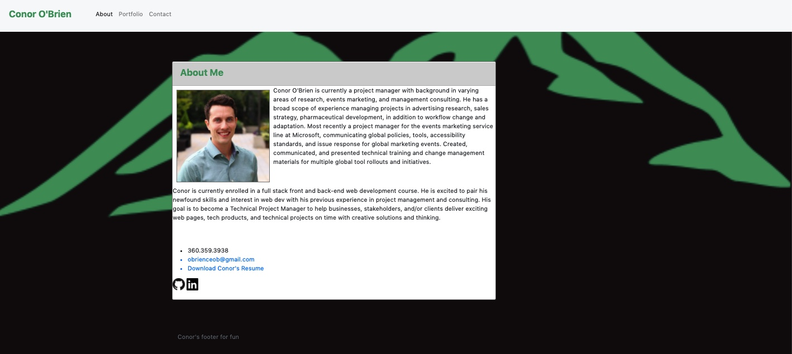

[Installation]
To get this webpage running, visit the website at https://obrienceob.github.io/ConorPortfolio/

If it is not on a github repository yet, you'll need a text editor. I reccomend VS Code. Download the zip file or code, or use GitHub's instructions to create a new repo. Uplaod the index.html, Develop folder with the script.js and style.css files to github using the git add, commit, and push commands.

Then ensure the file uploaded, open up the setting in your repo, and scroll down to the pages section. Change the source to "main" or "master" and save. 

[Usage]
Click each of the links in the header to drop down to a section below:

    About
    Portfolio
    Contact

[Code]

This portfolio contains an HTML page and CSS styling using bootstrap's library. There are links to some of my completed projects in the portfolio page, a summary of my on the index or landing page, along with my contact information and a downloadable resume PDF. You can also click the LinkedIN or GitHub icons to check out those sites. 

[Credits]

Following tutorials available here: 
    https://www.w3schools.com/tags/
    https://www.w3schools.com/css/default.asp

Background image from here: 
   Attribution https://commons.wikimedia.org/wiki/File:Green_mountains_icon.png, iconsdb.com, CC0, via Wikimedia Commons -->

[License]

MIT License

Copyright (c) [2020] [Conor O'Brien]

Permission is hereby granted, free of charge, to any person obtaining a copy
of this software and associated documentation files (the "Software"), to deal
in the Software without restriction, including without limitation the rights
to use, copy, modify, merge, publish, distribute, sublicense, and/or sell
copies of the Software, and to permit persons to whom the Software is
furnished to do so, subject to the following conditions:

The above copyright notice and this permission notice shall be included in all
copies or substantial portions of the Software.

THE SOFTWARE IS PROVIDED "AS IS", WITHOUT WARRANTY OF ANY KIND, EXPRESS OR
IMPLIED, INCLUDING BUT NOT LIMITED TO THE WARRANTIES OF MERCHANTABILITY,
FITNESS FOR A PARTICULAR PURPOSE AND NONINFRINGEMENT. IN NO EVENT SHALL THE
AUTHORS OR COPYRIGHT HOLDERS BE LIABLE FOR ANY CLAIM, DAMAGES OR OTHER
LIABILITY, WHETHER IN AN ACTION OF CONTRACT, TORT OR OTHERWISE, ARISING FROM,
OUT OF OR IN CONNECTION WITH THE SOFTWARE OR THE USE OR OTHER DEALINGS IN THE
SOFTWARE.

